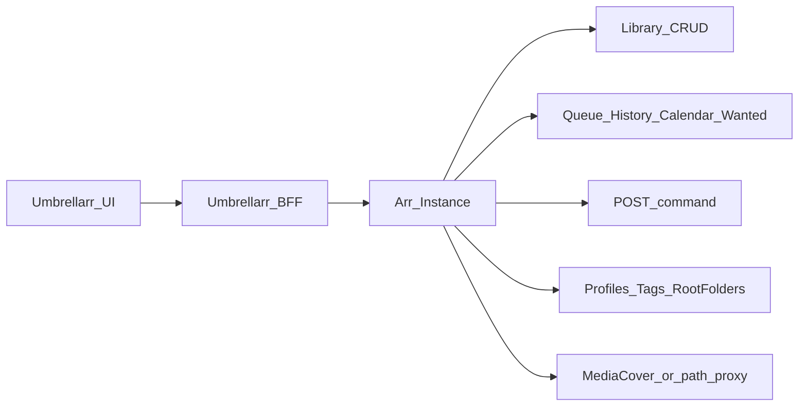

# Arr API Capability Map

Umbrellarr is a **nicer looking universal remote** for *arr apps. Work only with what Arr presents (API payloads or Arr’s own UI patterns). Do not invent movie/show/music metadata.

## Product rules

1. **Source of truth = Arr** — library items, profiles, tags, queue, history, wanted, commands.
2. **Actions = Arr commands/CRUD** — refresh/search/edit/delete via documented endpoints; no parallel media DB.
3. **UI chrome is ours** — layout, theming, virtualization; not new facts about titles.
4. **UI-only Arr patterns** — if Arr’s UI builds something client-side (e.g. external links from IDs), mirror Arr’s source and cite it; do not invent alternate URLs.
5. **Prefer fields Arr returns** — if a field isn’t on the movie/series/artist payload (or a related Arr endpoint), don’t fabricate it.

## Official docs

| App | Docs UI | OpenAPI JSON |
|-----|---------|--------------|
| Radarr | https://radarr.video/docs/api/ | https://raw.githubusercontent.com/Radarr/Radarr/develop/src/Radarr.Api.V3/openapi.json |
| Sonarr | https://sonarr.tv/docs/api/#v3 | https://raw.githubusercontent.com/Sonarr/Sonarr/develop/src/Sonarr.Api.V3/openapi.json |
| Lidarr | https://lidarr.audio/docs/api/ | https://raw.githubusercontent.com/lidarr/Lidarr/develop/src/Lidarr.Api.V1/openapi.json |

- Radarr / Sonarr: **`/api/v3`**
- Lidarr: **`/api/v1`**
- Auth: `X-Api-Key` header (see `apps/server/src/servarr/client.ts`)

## Architecture

## Capability map

Status legend for Umbrellarr: **Wired** / **Partial** / **Not started** / **Out of scope (for now)**

| Capability | Radarr v3 | Sonarr v3 | Lidarr v1 | Umbrellarr |
|------------|-----------|-----------|-----------|------------|
| Library list/detail/CRUD | `/movie` | `/series` (+ `/episode`) | `/artist`, `/album`, `/track` | Radarr list + detail **Wired**; Sonarr list + hero/toolbar + seasons/episodes **Wired**; Lidarr artist list + edit **Wired**; artist detail / albums **Not started** |
| Lookup / add | `/movie/lookup` | `/series/lookup` | `/artist/lookup`, `/album/lookup` | **Not started** |
| Refresh / search / rename via command | `POST /command` | same | same (`/api/v1`) | Radarr RefreshMovie, MoviesSearch, RenameFiles **Wired**; Sonarr RefreshSeries, SeriesSearch, SeasonSearch, EpisodeSearch, RenameFiles **Wired**; Lidarr RefreshArtist **Wired** |
| Queue / grab / remove | `/queue*` | `/queue*` | `/queue*` | **Partial** — Sonarr episode `downloading` via `/queue/details`; Activity Queue UI still placeholder |
| Calendar | `/calendar` | `/calendar` | `/calendar` | **Not started** |
| History | `/history*` | `/history*` | `/history*` | Radarr movie + Sonarr series/season history + details **Wired**; Lidarr **Not started** |
| Wanted missing / cutoff | `/wanted/*` | `/wanted/*` | `/wanted/*` | Cutoff IDs **Partial** (movies + series list filters); Missing UI **Not started** |
| Quality profiles + tags | yes | yes | yes (+ metadata profiles) | Radarr + Sonarr edit **Wired**; Lidarr quality + **metadata** profiles + tags **Wired** |
| Root folders / filesystem | yes | yes | yes | **Not started** (path is text) |
| Interactive search / release | `/release` | `/release` | `/release` | Radarr movie + Sonarr series / season / episode interactive search **Wired**; Lidarr **Not started** |
| Movie file manage (metadata / delete) | `/moviefile*` | `/episodefile*` | `/trackfile*` | Radarr + Sonarr Manage Files **Wired**; Lidarr **Not started** |
| Bulk editor | `/movie/editor` | `/series/editor` | `/artist/editor` | **Not started** |
| System health / status | `/system/status`, `/health` | same | same | **Wired** (status) |
| Covers | `/MediaCover/...` or mediacover API | similar | `/api/v1/mediacover/{artist or album}/{id}/{file}` (API matches jpg/png/gif only; SPA `/MediaCover/` is login HTML) | Radarr + Sonarr **Wired** (`/MediaCover/` + `-500`); Lidarr artist **Wired** (mediacover API; `.jpeg` posters use another Arr image) |
| Poster status bars | Index footer / `getProgressBarKind` + queue | same | same | **Wired** — Arr colors/states (incl. queued/downloading via `/queue`) |
| Indexers / download clients / import lists / notifications | full settings APIs | same | same | **Out of scope (for now)** |
| External “Links” menu | **No API** — Arr UI only | similar | similar | Radarr + Sonarr + Lidarr **Wired** (mirror UI patterns; Lidarr cites `ArtistDetailsLinks.js`) |

## Umbrellarr instance support

| Kind | Config | In `ArrKind` | Library wired |
|------|--------|--------------|---------------|
| Radarr | Settings (SQLite) + optional first-run `RADARR_*` env import | yes | yes (per-instance `/movies/$instanceId`) |
| Sonarr | Settings (SQLite) + optional first-run `SONARR_*` env import | yes | yes (per-instance `/shows/$instanceId`; detail + seasons/episodes) |
| Lidarr | Settings (SQLite) + optional first-run `LIDARR_*` env import | yes | yes (per-instance `/music/$instanceId` artist grid; no detail yet) |

API keys encrypted in SQLite (`INSTANCE_SECRETS_KEY`). Env Arr vars import once when the DB is empty.

## Decision checklist (before building a feature)

1. Does Arr expose this via API? → Use that endpoint; map fields, don’t enrich.
2. Does Arr’s UI do it client-side from API fields? → Mirror Arr frontend source; cite the file.
3. Would we need a third-party metadata API or scraping? → **Don’t**, unless the user explicitly expands product scope.
4. After adding an upstream call → append a row in [umbrellarr-wiring.md](umbrellarr-wiring.md).

## Progressive disclosure

- Endpoint groups, commands, UI-only patterns, do-not-invent list → [reference.md](reference.md)
- Current BFF ↔ Arr call map → [umbrellarr-wiring.md](umbrellarr-wiring.md)
