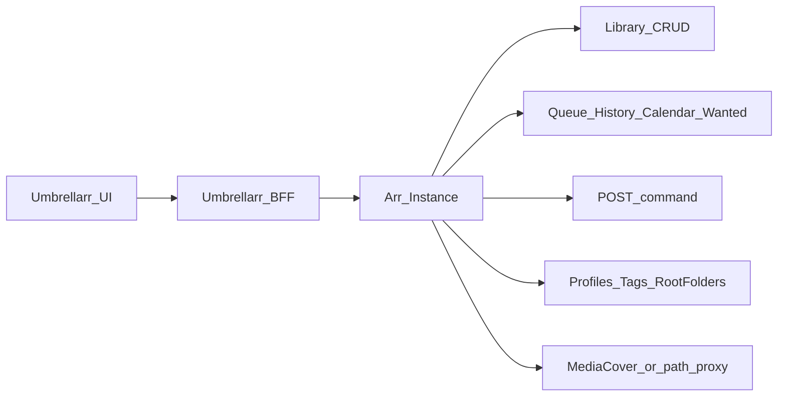
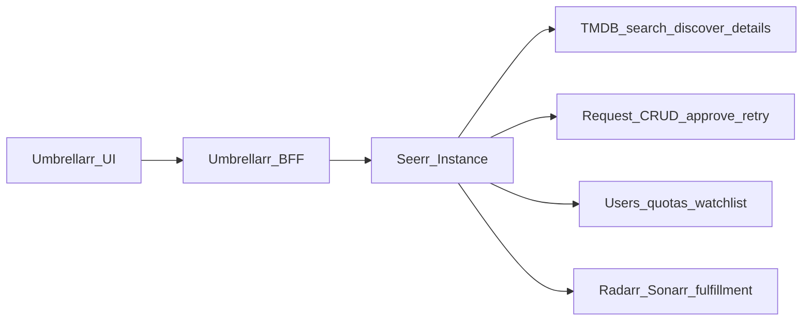

# Arr + Seerr API Capability Map

Umbrellarr is two products in one UI:

- **Library remote** — nicer chrome over Radarr / Sonarr / Lidarr (list, detail, edit, search, files).
- **Request + Discover** — our own pages, backed by **Seerr** (search, discover rows, request create/approve/retry, availability badges).

Work only with what those apps present (API payloads or their own UI patterns). Do not invent movie/show/music metadata. Do not clone Seerr’s SPA — use Seerr’s API, keep Umbrellarr chrome.

## Product rules

1. **Library source of truth = Arr** — library items, profiles, tags, queue, history, wanted, commands.
2. **Actions = Arr commands/CRUD** — refresh/search/edit/delete via documented endpoints; no parallel media DB.
3. **Discover + requests source of truth = Seerr** — search, discover, movie/TV details, `mediaInfo` availability, request CRUD, watchlist, blocklist. Seerr already wraps TMDB; **never** add a TMDB client or scrape for Discover/request features.
4. **UI chrome is ours** — layout, theming, virtualization; not new facts about titles. Discover/request pages are first-class Umbrellarr routes, not an iframe of Seerr.
5. **UI-only patterns** — if Arr or Seerr’s UI builds something client-side (links, image URL templates, slider → endpoint map), mirror that source and cite it.
6. **Prefer fields the upstream returns** — if a field isn’t on the Arr movie/series/artist payload or a Seerr schema, don’t fabricate it.

## Official docs

| App | Docs UI | OpenAPI |
|-----|---------|---------|
| Radarr | https://radarr.video/docs/api/ | https://raw.githubusercontent.com/Radarr/Radarr/develop/src/Radarr.Api.V3/openapi.json |
| Sonarr | https://sonarr.tv/docs/api/#v3 | https://raw.githubusercontent.com/Sonarr/Sonarr/develop/src/Sonarr.Api.V3/openapi.json |
| Lidarr | https://lidarr.audio/docs/api/ | https://raw.githubusercontent.com/lidarr/Lidarr/develop/src/Lidarr.Api.V1/openapi.json |
| Seerr | https://docs.seerr.dev/api/seerr-api/ | https://raw.githubusercontent.com/seerr-team/seerr/develop/seerr-api.yml |

- Radarr / Sonarr: **`/api/v3`**
- Lidarr / Seerr: **`/api/v1`** (same prefix, different apps — do not mix clients)
- Arr auth: `X-Api-Key` header (see `apps/server/src/servarr/client.ts`)
- Seerr auth: `X-Api-Key` header **or** `connect.sid` cookie after `/auth/plex`, `/auth/jellyfin`, or `/auth/local`
- Seerr OpenAPI can lag the live API — fetch the YAML above when wiring; do not invent fields to paper over gaps

## Architecture

Seerr is a **request + discovery** layer (Overseerr/Jellyseerr successor), not a Servarr library manager. It fulfills via Radarr/Sonarr only — **no Lidarr**. Library CRUD still goes to Arr. Adding a title from Discover goes `POST /request` on Seerr (not Arr `/movie` lookup).

## Planned Umbrellarr surfaces (Seerr)

These are **in scope**. Chrome is ours; every fact comes from Seerr.

| Surface | What the user does | Seerr we use |
|---------|--------------------|--------------|
| **Discover** | Browse trending / popular / upcoming / filtered rows; open title; request | `GET /discover/*`, `GET /search`, `GET /movie/{tmdbId}`, `GET /tv/{tmdbId}` (+ season, similar, recommendations, ratings). Optional `GET /settings/discover` to reuse Seerr slider config. |
| **Requests** | List pending/approved/available; approve, decline, retry, delete; create from Discover | `GET/POST /request`, `GET /request/count`, `GET/PUT/DELETE /request/{id}`, `POST /request/{id}/{status}`, `POST /request/{id}/retry` |
| **Request from a card** | One-click (or season-pick) request | `POST /request` with TMDB `mediaId`; optional `GET /service/radarr` / `/service/sonarr` for server/profile/root folder |

Discover result cards already include `mediaInfo` (availability + existing requests). Use that for badges — do not infer “in library” from Arr on this page.

Poster/backdrop on Seerr payloads are TMDB relative paths (`posterPath`). Mirror Seerr: `https://image.tmdb.org/t/p/{size}{posterPath}` (e.g. `w600_and_h900_bestv2`), or Seerr’s `/imageproxy/tmdb/...` when their image cache is on. Cite [CachedImage](https://github.com/seerr-team/seerr/blob/develop/src/components/Common/CachedImage/index.tsx). Do not use Arr `/MediaCover` for Discover.

## Capability map

Status legend for Umbrellarr: **Wired** / **Partial** / **In scope / Not started** / **Not started** / **Out of scope (for now)**

| Capability | Radarr v3 | Sonarr v3 | Lidarr v1 | Umbrellarr |
|------------|-----------|-----------|-----------|------------|
| Library list/detail/CRUD | `/movie` | `/series` (+ `/episode`) | `/artist`, `/album`, `/track` | Radarr list + detail **Wired**; Sonarr list + hero/toolbar + seasons/episodes **Wired**; Lidarr artist list + detail + album rows + album tracks modal **Wired**; album detail route **Not started** |
| Collections | `/collection` + `RefreshCollections` | — | — | Radarr list + bulk update + refresh **Wired** (not Seerr/TMDB collections) |
| Lookup / add | `/movie/lookup` | `/series/lookup` | `/artist/lookup`, `/album/lookup` | Radarr + Sonarr lookup + add **Wired**; Lidarr **Not started** |
| Refresh / search / rename via command | `POST /command` | same | same (`/api/v1`) | Radarr RefreshMovie, MoviesSearch, RenameFiles **Wired**; Sonarr RefreshSeries, SeriesSearch, SeasonSearch, EpisodeSearch, RenameFiles **Wired**; Lidarr RefreshArtist, ArtistSearch, AlbumSearch, RenameFiles, RetagFiles **Wired** |
| Queue / grab / remove | `/queue*` | `/queue*` | `/queue*` | **Wired** (per-instance movies/shows/music queue: list/poll, grab, remove, manual import); unified `/activity/queue` still placeholder |
| Calendar | `/calendar` | `/calendar` | `/calendar` | Unified `/activity/calendar` + aggregated `/api/calendar.ics` **Wired** |
| History | `/history*` | `/history*` | `/history*` | Radarr movie + Sonarr series/season + Lidarr artist history + details **Wired** |
| Wanted missing / cutoff | `/wanted/*` | `/wanted/*` | `/wanted/*` | Cutoff IDs **Partial** (movies + series list filters); Missing UI **Not started** |
| Quality profiles + tags | yes | yes | yes (+ metadata profiles) | Radarr + Sonarr edit **Wired**; Lidarr quality + **metadata** profiles + tags **Wired** |
| Root folders / filesystem | yes | yes | yes | **Not started** (path is text) |
| Interactive search / release | `/release` | `/release` | `/release` | Radarr movie + Sonarr series / season / episode + Lidarr artist interactive search **Wired** |
| Movie file manage (metadata / delete) | `/moviefile*` | `/episodefile*` | `/trackfile*` (+ `/track` join) | Radarr + Sonarr Manage Files **Wired**; Lidarr Manage Tracks (Track/Path/Quality) **Wired** |
| Bulk editor | `/movie/editor` | `/series/editor` | `/artist/editor` | **Not started** |
| System health / status | `/system/status`, `/health` | same | same | **Wired** (status) |
| Covers | `/MediaCover/...` or mediacover API | similar | `/api/v1/mediacover/{artist or album}/{id}/{file}` (API matches jpg/png/gif only; SPA `/MediaCover/` is login HTML) | Radarr + Sonarr **Wired** (`/MediaCover/` + `-500`); Lidarr artist **Wired** (mediacover API; `.jpeg` posters use another Arr image) |
| Poster status bars | Index footer / `getProgressBarKind` + queue | same | same | **Wired** — Arr colors/states (incl. queued/downloading via `/queue`) |
| Indexers / download clients / import lists / notifications | full settings APIs | same | same | **Out of scope (for now)** |
| External “Links” menu | **No API** — Arr UI only | similar | similar | Radarr + Sonarr + Lidarr **Wired** (mirror UI patterns; Lidarr cites `ArtistDetailsLinks.js`) |

### Seerr (`/api/v1`) — Discover + requests (in scope)

| Capability | Seerr path | Umbrellarr |
|------------|------------|------------|
| Search (movie / tv / person / collection) | `GET /search` | **In scope / Not started** — Discover + header search |
| Discover rows + filters | `GET /discover/movies`, `/discover/tv`, `/discover/trending`, `.../upcoming`, genre/studio/network/keyword | **In scope / Not started** — our Discover page |
| Discover slider config | `GET /settings/discover` | **In scope / Not started** — optional: reuse Seerr’s row list instead of hardcoding |
| Movie / TV details (+ similar, recommendations, ratings) | `GET /movie/{id}`, `GET /tv/{id}` (+ season) | **Partial** — request detail page (no recommendations/similar); Discover title pages **Not started** |
| Filter helpers (genres, providers, certs, regions) | `/genres/*`, `/watchproviders/*`, `/certifications/*`, `/regions`, `/languages` | **In scope / Not started** — Discover filter UI |
| Create / list / update / delete request | `GET/POST /request`, `GET/PUT/DELETE /request/{id}` | List + PUT edit **Wired**; create/delete **Not started** |
| Approve / decline / retry | `POST /request/{id}/{status}`, `POST /request/{id}/retry` | Approve/decline **Wired**; retry **Not started** |
| Request counts | `GET /request/count` | **Partial** — BFF exists; sidebar badge not wired |
| Tracked media + status | `GET /media`, `POST /media/{id}/{status}` | **In scope / Not started** — availability; file delete is Arr-side |
| Watchlist | `POST/DELETE /watchlist`, `GET /user/{id}/watchlist`, `GET /discover/watchlist` | **In scope / Not started** — Discover row |
| Blocklist | `GET/POST /blocklist`, `/blocklist/{tmdbId}` (`/blacklist` alias) | **In scope / Not started** — hide from Discover |
| Radarr/Sonarr service list + profiles | `GET /service/radarr`, `GET /service/sonarr` (+ `/{id}`) | **Wired** — Request edit modal |
| Status | `GET /status` | **Wired** — Settings Test + instances-online |

Seerr `mediaId` on requests is a **TMDB id**. Movie/TV only — no music. Request `status`: `1` pending, `2` approved, `3` declined. Media `status`: `1` unknown, `2` pending, `3` processing, `4` partial, `5` available, `6` deleted.

### Seerr — out of scope (for now)

Users/quotas/permissions admin, issues, Plex/Jellyfin settings + sync, notification agents, jobs/cache/logs, override rules, Seerr slider **admin** write (`POST/PUT/DELETE /settings/discover`). Read sliders is OK.

## Umbrellarr instance support

| Kind | Config | In `ArrKind` | Library wired |
|------|--------|--------------|---------------|
| Radarr | Settings (SQLite) + optional first-run `RADARR_*` env import | yes | yes (per-instance `/movies/$instanceId`) |
| Sonarr | Settings (SQLite) + optional first-run `SONARR_*` env import | yes | yes (per-instance `/shows/$instanceId`; detail + seasons/episodes) |
| Lidarr | Settings (SQLite) + optional first-run `LIDARR_*` env import | yes | yes (per-instance `/music/$instanceId` + `/music/$instanceId/$artistId`) |
| Seerr | Settings (SQLite) + optional first-run `SEERR_*` env import | `InstanceKind` only (not `ArrKind`) | Requests list + detail + approve/decline/edit **Wired**; Discover **Not started** |

API keys encrypted in SQLite (`INSTANCE_SECRETS_KEY`). Env Arr vars import once when the DB is empty.

## Decision checklist (before building a feature)

1. Is this a **library** feature (list/edit/search/rename/files)? → Arr endpoint; map fields, don’t enrich.
2. Is this **Discover, header search, or a request**? → Seerr only. Compose our page from `/discover`, `/search`, `/request`. Do not invent a TMDB client. Do not add via Arr `/movie/lookup` from Discover.
3. Need availability / “already requested” on a Discover card? → `mediaInfo` on the Seerr result. Do not join Arr library by title.
4. Does Arr or Seerr’s UI do it client-side (links, image sizes, slider → path)? → Mirror that frontend source; cite the file.
5. Would we need a third-party metadata API or scraping? → **Don’t**, unless the user explicitly expands product scope (existing Sonarr trailer/ratings scrapes are the exception — already wired).
6. After adding an upstream call → append a row in [umbrellarr-wiring.md](umbrellarr-wiring.md).

## Progressive disclosure

- Endpoint groups, commands, Seerr Discover/request playbook, UI-only patterns → [reference.md](reference.md)
- Current BFF ↔ Arr call map → [umbrellarr-wiring.md](umbrellarr-wiring.md)
